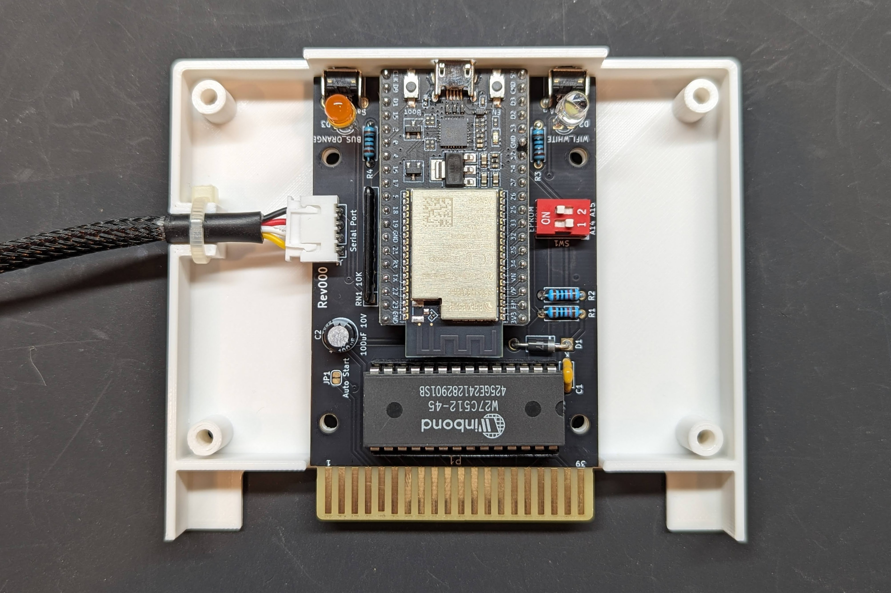

Repo for early testing of FujiNet PCB's for the Tandy Color Computer

# Rev0

Needs to be reworked to connect the CD pin of the serial port to IO22 on the ESP32.  Bend up the forth pin on a 4 pin XH2.54 connector, solder some wire to it, insert the remaining three pins in J1 (Serial Port), and solder the 4th pin with the bodge wire to IO22 on the ESP32.

You also need to cut the trace between the output of the low pass filter and the input to the LM386 pot in order to install a small capacitor to remove the DC offset.  It's on the underside of the PCB between pin one of R12 and pin two of R17.  Any small electrolytic cap around 10uF should work.

KiCad PCB Layout - https://djtersteegc.github.io/Coco-FujiNet/pcb-traces-rev0.png

BOM and build is the same as Rev00 to see below for more info.

# Rev00

Connected the CD pin of the serial port to IO22.  You will still need to install the capacitor on the back if attempting to build the cassette portion of the board.

Schematic - https://djtersteegc.github.io/Coco-FujiNet/CoCo-FujiNet-Rev00-Schematic.pdf

Interactive BOM - https://djtersteegc.github.io/Coco-FujiNet/ibom-Rev00.html

You'll need 8.5mm high [2.54mm female header strips](https://www.aliexpress.us/item/2251832416528370.html) to mount the ESP32.  Buy the 1x40 versions and cut to length.

MicroSD socket footprint is the common [Chinese push-push version](https://www.aliexpress.us/item/2251832613969983.html) used on all the FujiNet's to date.

You can either assemble the LM386 based amp circuit, or use one of these [premade modules](https://www.aliexpress.us/item/3256805809816872.html) on the board instead. If using the module all the components in the outline area can be excluded, as well as C2 and C7.

The cable sockets on the board are the cheap [XH2.54 4p angle](https://www.aliexpress.us/item/2251832735749189.html) connectors.   Buy some [prewired female connectors](https://www.aliexpress.us/item/2255801048702387.html) for cable making.  You'll need a [DIN4 male](https://www.aliexpress.us/item/3256804124853512.html) plug for the serial port, and [DIN5 male](https://www.aliexpress.us/item/3256804124853512.html) plug for the cassette port.

# Building a "Minimal" Rev0/00

If you already have a CocoSDC or some other way to load HDB-DOS with DriveWire 3 support, you can skip building the cassette  portion of the board.

Here's what a minimal build looks like.  You'll only need R9, R11, R13, RN1, D1, D3, two 6mm tact switches, the MicroSD card socket, some female headers for the ESP, and one XH2.54 4p connector.

## Flashing HDB-DOS on your CocoSDC

Grab SDCFLASH from the [Color Computer Archive](https://colorcomputerarchive.com/search?q=SDCFLASH). It contains a number of different HDB-DOS images for the various Coco models.

`HDBDW3C1.ROM - HDB-DOS for Drivewire 3 (Coco 1) (Cloud-9)
HDBDW3C2.ROM - HDB-DOS for Drivewire 3 (Coco 2) (Cloud-9)
HDBDW3C3.ROM - HDB-DOS for Drivewire 3 (Coco 3) (Cloud-9)`

Since I'm using a Coco2, I used **HDBDW3C2.ROM** and flashed it to the slot number 3 on my CocoSDC.  Set your DIP jumpers accordingly to use this new ROM image instead of the standard SDC-DOS image in slot 0. See the CocoSDC docs for more details.

# Rev000

Rev000 does away with the tape circuit and moves to a ROM for bootstrapping HDB-DOS, similar to a "minimal" Rev00 build and bootstraping via a CocoSDC or other ROM cart.  Since it is now a cartridge format, you no longer need to power the ESP32 via USB, and instead it will normally take 5V from the cartridge port.  There is a diode so if you do want to power by USB for debug logging or other reasons it is safe to do so without backfeeding into the Coco.

Schematic - https://djtersteegc.github.io/Coco-FujiNet/CoCo-FujiNet-Rev000-Schematic.pdf

Interactive BOM - https://djtersteegc.github.io/Coco-FujiNet/ibom-Rev000.html

The [3D printable case](CoCo-FujiNet-Rev000/3D/STL) is designed for 5mm LED's and 8mm right angle tact switches.

Unlike the previous revisions, you will need to solder the ESP32 onto the PCB since the cartridge format is to short to allow it to be mounted on standard 8.5mm tall female headers. Print four of the [4mm spacers](CoCo-FujiNet-Rev000/3D/STL/CoCo-FujiNet-Rev000-4mm-Spacer.stl) to mount the ESP32 elevated from the PCB to help improve the wifi performance and provide more space between the SD slot and USB port.

The DIP switch allows for up to four 16K ROM images to loaded and selected on a 27c512 (or equivalent) EPROM. There is a precompiled image in the [ROM directory](ROM) with HDB-DOS DriveWire 3 images for the various Coco's from the hdbdos-snapshot20190324 as well as a diagnostics ROM from the Color Computer Archive.

| ROM                                       | SW1-1 (A14) | SW1-2 (A15) |
| ----------------------------------------- | ----------- | ----------- |
| hdbdw3cc1.rom                             | ON          | ON          |
| hdbdw3cc2.rom                             | OFF         | ON          |
| hdbdw3cc3.rom                             | ON          | OFF         |
| Diagnostics v2.0 (1982) (26-3019) (Tandy) | OFF         | OFF         |

The case is designed to be printed at a 0.2mm layer height.  Secure the PCB and two case halves with four M3x10mm to 20mm screws in the center four holes, and optionally four M3x16mm to 20mm screws in the outer four holes.  Overkill, but results in a very solid feeling cartridge with minimal gaps between the two halves.

# Building the Serial Cable

The DIN 4 serial cable pinout (looking at it from the backside of the connector) with the corresponding XH connector pins (they are also marked on the PCB).

And some completed cable pics:

# Flashing Your FujiNet

At this stage there is no official release of the Coco firmware in the [Fujinet Flasher](https://fujinet.online/download/).  But you can still use it to easily flash a precompile version (check the Discord), or you can [compile one yourself](https://github.com/FujiNetWIFI/fujinet-firmware/wiki/Board-Bring-Up-Software).

# Usage

Rev0 and Rev00 - Plug serial cable into your Coco's serial port. Supply power to the Fujinet via the USB port on the ESP32. Plug CocoSDC or other ROM cart into cart slot to bootstrap HDB-DOS.

Rev000 - Insert into cart slot and plug attached cable into your Coco's serial port.

Assuming the FujiNet device (and CocoSDC if needed) is correctly flashed, it should launch into the Fujinet config app on power up.

